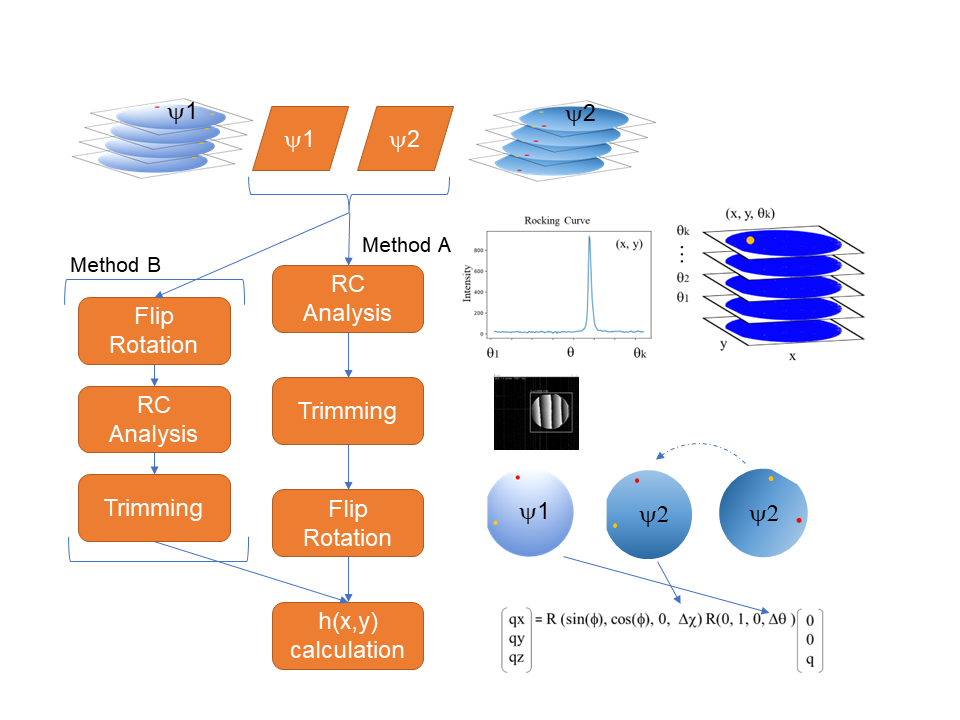

## X-ray visualization of local bending of the lattice planes (V-LBLP)

### Introduction

This tool can be used to analyze and visualization of local bending of the lattice planes (V-LBLP) measured at a synchrotron radiation facility.

The V-LBLP is a method of visualizing the minute "distortion" of the wafer crystal plane with the spatial resolution of the pixel size of the detector (50 micrometers in this device) on the entire surface of the wafer. 

In the V-LBLP, the incident angle ($\theta$) of X-rays is changed to a minute (about ± 300 arcsec from the Bragg reflection position), and two-dimensional X-ray Rocking-Curve (RC) is acquired. This measurement is performed by changing the incident direction ($\psi $: two or more directions) of the wafer. The peak analysis of RC, which is a function of the angle, is performed for each image pixel, and the angle component h (q) of the surface of the crystal plane is calculated using the analysis values of each direction.

The tool consists of the following three.

(1) GUI image conversion software (Image Editor) that merges data with different incident directions

(2)  Package for fitting RC (peak, full width at half maximum and  intensity), and for calculation crystal plane angle component h (q)

(3) Jupyter Notebook that uses the above two modules according to the following analysis procedure.

Figure 1 shows the flow of the analysis procedure. Two flows are prepared for the analysis. 

First, regardless of which flow you use, check the data. In Method A, RC analysis is performed, then the trimmed image is rotated, and then h(q) is calculated. In Method B, the data image is rotated first, then RC analysis and trimming are performed, and then h(q) is calculated.



**Fig. 1 Calculation flow. There are two types of analysis methods**


**Method A**

(0) Prepare and confirm data with different orientations

(1) RC calculation from 2D data 

(2) Trimming the margins (outside the wafer) of the 2D image

(3) Rotate and move the calculated 2D RC data to align the two images. 

(4) q calculation using the RC calculation result after alignment  


**Method B**

(0) Prepare and confirm data with different orientations

(1) Rotate and move 2D data with different incident directions to align the two images.

(2) RC calculation from 2D data that has been aligned 

(3) Trimming the margins (outside the wafer) of the 2D image 

(4) q calculation from RC calculation results

In this manual, the procedure is described according to Method A. In addition, a template for the analysis procedure of each method is prepared in Jupyter Notebook.

- Method A for 2 directions: temp_rc2rot_2phi.ipynb 
- Method A  for 3 directions: temp_rc2rot_3phi.ipynb 
- Method B for 2 directions: temp_rot2rc_2phi.ipynb 
- Creating an Angle file: temp_anglefile.ipynb 

As an analysis example, the 4-inch analysis result used in the paper [1] is attached to ex_rc2rot_4inch_3phi_gauss.html.

 In addition, other analysis reference examples are also attached to the html folder. 

- Calculation of $\Delta d $: ex_dd_d.html

- Radial direction calculation of half width: ex_radius_average.html 

  

### Install the required modules and download the XRLM package 

#### Requrired PC power

- OS：Windows  / Linux / Mac

- Memory: 16GB over

- CPU Core：4 cores over

#### Requrired modules 

- Python 3.8 over

- IDE: Visual studio code（recomended）

##### Pure python

```python
pip install PyQt5, opencv-python, Pillow, scipy, numpy, matplotlib, tifffile, pandas, jupyter
```

##### Anaconda  (if use virtual environment)

Example  name: xrdt,  python=3.8

```powershell
conda create --name xrdt python=3.8
```

```powershell
conda activate xrdt
conda install -c conda-forge opencv matplotlib jupyter pandas scipy tifffile pillow 
```

Note: opencv version is need to over 4.4.

#### Download V-LBLP packege

- Clone or Zip from NIMS MDR ripositry or our github repository.

Note: After this paper is accepted, the web address of this sorce cord is entered.

https://github.com/s-yagyu/ 
