## X-ray visualization of local bending of the lattice planes (XR-V-LBLP)


[TOC]


### 1. Introduction

This tool can be used to analyze and visualization of local bending of the lattice planes (V-LBLP) measured at a synchrotron radiation facility.

The V-LBLP is a method of visualizing the minute "distortion" of the wafer crystal plane with the spatial resolution of the pixel size of the detector (50 micrometers in this device) on the entire surface of the wafer. 

In the V-LBLP, the incident angle ($\theta$) of X-rays is changed to a minute (about ± 300 arcsec from the Bragg reflection position), and two-dimensional X-ray Rocking-Curve (RC) is acquired. This measurement is performed by changing the incident direction ($\psi $: two or more directions) of the wafer. The peak analysis of RC, which is a function of the angle, is performed for each image pixel, and the angle component h (q) of the surface of the crystal plane is calculated using the analysis values of each direction.

The tool consists of the following three.

(1) GUI image conversion software (Image Editor) that merges data with different incident directions

(2)  Package for fitting RC (peak, full width at half maximum and  intensity), and for calculation crystal plane angle component h (q)

(3) Jupyter Notebook that uses the above two modules according to the following analysis procedure.

Figure 1 shows the flow of the analysis procedure. Two flows are prepared for the analysis. 

First, regardless of which flow you use, check the data. In Method A, RC analysis is performed, then the trimmed image is rotated, and then h(q) is calculated. In Method B, the data image is rotated first, then RC analysis and trimming are performed, and then h(q) is calculated.

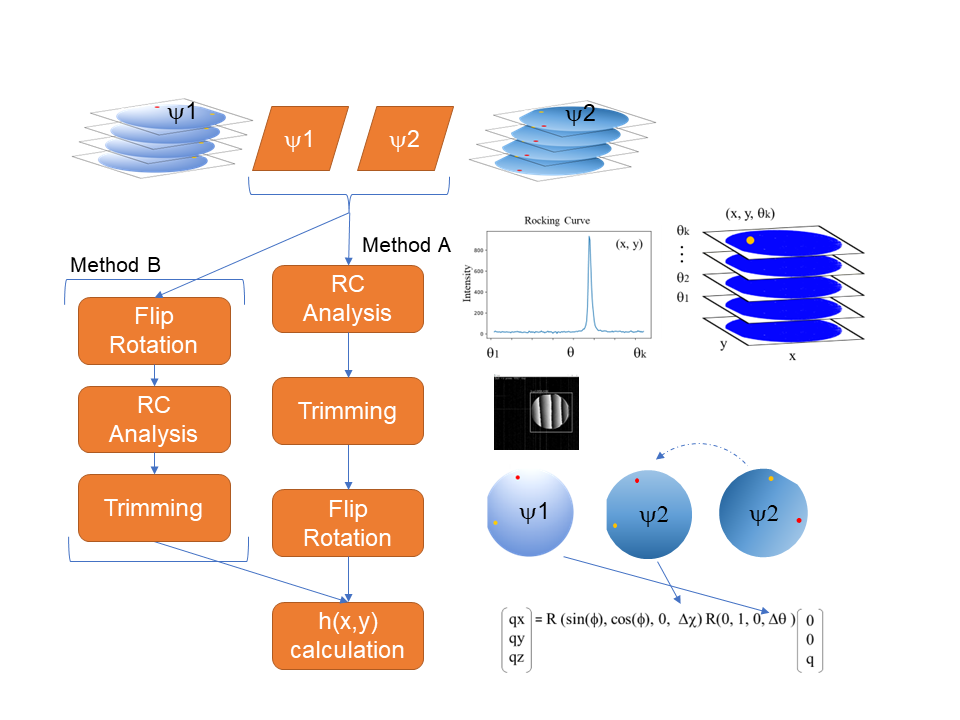

**Fig. 1 Calculation flow. There are two types of analysis methods**


**Method A**

(0) Prepare and confirm data with different orientations

(1) RC calculation from 2D data 

(2) Trimming the margins (outside the wafer) of the 2D image

(3) Rotate and move the calculated 2D RC data to align the two images. 

(4) q calculation using the RC calculation result after alignment  


**Method B**

(0) Prepare and confirm data with different orientations

(1) Rotate and move 2D data with different incident directions to align the two images.

(2) RC calculation from 2D data that has been aligned 

(3) Trimming the margins (outside the wafer) of the 2D image 

(4) q calculation from RC calculation results

In this manual, the procedure is described according to Method A. In addition, a template for the analysis procedure of each method is prepared in Jupyter Notebook.

- Method A for 2 directions: temp_rc2rot_2phi.ipynb 
- Method A  for 3 directions: temp_rc2rot_3phi.ipynb 
- Method B for 2 directions: temp_rot2rc_2phi.ipynb 
- Creating an Angle file: temp_anglefile.ipynb 

As an analysis example, the 4-inch analysis result used in the paper [1] is attached to ex_rc2rot_4inch_3phi_gauss.html.

 In addition, other analysis reference examples are also attached to the example_html folder. 

- Calculation of $\Delta d $: ex_dd_d.html
- Radial direction calculation of half width: ex_radius_average.html 


### 2. Install the required modules and download the V-LBLP package 

#### Requrired PC power

- OS：Windows  / Linux / Mac

- Memory: 16GB over

- CPU Core：4 cores over

#### Requrired modules 

- Python 3.8 over 

- IDE: Visual studio code（recomend）

##### Pure python

```python
pip install PyQt5, opencv-python, Pillow, scipy, numpy, matplotlib, tifffile, pandas, jupyter
```

##### Anaconda  (if use virtual environment)

Example  name: xrdt,  python=3.8

```powershell
conda create --name xrdt python=3.8
```

```powershell
conda activate xrdt
conda install -c conda-forge opencv matplotlib jupyter pandas scipy tifffile pillow 
```

Note: opencv version is need to over 4.4.

#### Download V-LBLP packege

- Clone or Zip from NIMS MDR ripositry or our github repository.

https://github.com/s-yagyu/V-LBLP


####  Folder structure in the package

```
Folder structure

src
|-docs							# document
| |-figs
| |-Analysis_manual.md
| |-Analysis_manual.pdf
| |-Image_editor_manual.md
|
|-example_html							# example for analysis
| |-ex_4inch_rc2rot_3psi_gauss.html # Results of the 4-inch analysis used in this paper
| |-ex_dd_d.html				 	# Calculation dd/d
| |-ex_radius_average.html		 	# Calculate the average for the radial direction
| |-ex_rc_filter.html			 	# Check RC and determine filter value
|
|-image_editor						# affine transform of data using GUI
| |-...(abbreviation)
| |-affine_transformation_parameters_editor_r.py # GUI for data rotation (New version)
|
|-qfit						# Main analysis module
| |-...(abbreviation)
| |-file_folder_trans.py	# file and folder search, convert and  transfer
| |-fit.py 					# RC calculation core Program
| |-fit_q.py 				# interface for jupyter (calling functions)
| |-radial_average.py 		# for radial direction analysis
| |-image_split.py 			# for image split analysis
| |-image_treat.py 			# trimming and calling image editor
| |-make_angle_file.py		# angle file core program
| |-multiplot.py 			# for making figure
| |-q2.py					# q calculation core program
| |-re_analysis.py 			# data load and main analytical tools
| |-re_plot.py 				# plot parts
| |-d_limit.py 				# delta d calculation program
| |-data_check.py 			# RC check and determination of filter values
|
|-temp_anglefile.ipynb		# create Angle file template
|-temp_rc2rot_2phi.ipynb	# Method A RC -> rot-> q for 2 directions template
|-temp_rc2rot_3phi.ipynb	# Method A RC -> rot-> q for 3 directions template
|-temp_rot2rc_2phi.ipynb	# Method B rot -> rc-> q for 2 directions template
|-run_image_editor.ipynb	# image editor and trimming GUI program run template
|-temp_rc_filter.ipynb		# Check RC and determine filter value
|-Readme.md
```


### 3. Specific flow of calculations

Here, the analysis procedure is explained according to temp_rc2rot_2phi.ipynb.

#### (1) Data preparation

##### Check data and data Folder

Figure 2 shows a schematic diagram of each holder and its files. Two-dimensional data with different incident angles are stored in the same folder.

Data for each incident angle and data not irradiated with X-rays (dark data) are saved in tif format in each folder. Only dark data files should be named *dark.tif*.

The angle file is a file that associates the incident angle information with the data file name. The Angle file is in csv format, and the column name of angel and filename is described on the 0th row, and the angle and file name are described on the 1st and subsequent rows. The angle unit is arcsec. The file extension is .txt.

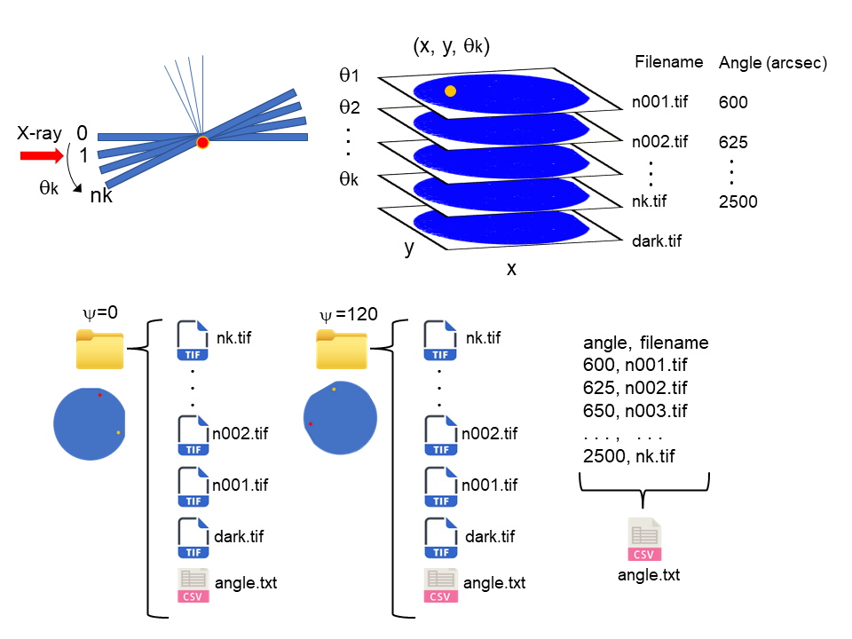

**Fig.2　Schematic diagram of experimental data folders and files**

##### Create angle file

As shown in Fig. 2, the angle of incidence is taken in the direction in which the angle of incidence increases, with reference to the parallel position of the sample with respect to the two-dimensional detector. The unit of angle is arcsec (1 arcsec = 1/3600 deg). 

Angle files can be created manually using Excel or other tools, or using the attached template program (**temp_anglefile.ipynb**).

If the data folder used for RC analysis does not have an angle file (angle.txt), an error will occur.

(Method A requires an angle file in the data folder, and Method B requires an angle file in the rotated folder.)

- Module import

```python
from qfit import make_angle_file as maf
from qfit import fit_q
from qfit import re_analysis as rean
from qfit import re_plot as replt
from qfit import multiplot as mlplt
from qfit import image_treat as imt
from qfit import file_folder_trans as fft
```

- Set target folder path
```python
g_0 = r""
g_120 = r""

# example
# g_0 = r"D:\XrayDataset_for_paper\data_0"
# g_120 = r"D:\XrayDataset_for_paper\data_120"
```

- Check angle file
```python
# Check if it contains tif data, angle.text, and dark data.
# psi=0
_ = maf.check_holder(data_path=g_0)

# psi=120
_ = maf.check_holder(data_path=g_120)

# Output example
>>>Data path:D:\XrayDataset_for_paper\data_0
>>>Dark file exist  T/F: True
>>>Number of all tif files : 90
>>>Number of tif data files without dark file: 89
>>>tif data name: ['-180000.tif', '-182500.tif', '-185000.tif', '-187500.tif', >>>'-190000.tif']...['-390000.tif', '-392500.tif', '-395000.tif', '-397500.tif', >>>'-400000.tif']
>>>angle file exist T/F: True  
>>>-----
>>>Data path:D:\XrayDataset_for_paper\data_120
>>>Dark file exist  T/F: True
>>>Number of all tif files : 82
>>>Number of tif data files without dark file: 81
>>>tif data name: ['-280000.tif', '-282500.tif', '-285000.tif', '-287500.tif', >>>'-290000.tif']...['-470000.tif', '-472500.tif', '-475000.tif', '-477500.tif', >>>'-480000.tif']
>>>angle file exist T/F: True
>>>-----
```

If the angle file does not exist, you need to go back and create the angle file. -> temp_anglefile.ipynb


- check the contents of the angle file

```python
# If the angle file exists, check the contents of the angle file 
maf.anglefile_info(data_path=g_0)
print('-'*5)
maf.anglefile_info(data_path=g_120)

# Output example
>>>Check angle file exist T/F: True
>>>Read angle file:    angle     filename
>>>0   1800  -180000.tif
>>>1   1825  -182500.tif
>>>2   1850  -185000.tif
>>>3   1875  -187500.tif
>>>4   1900  -190000.tif
>>>Read angle file:     angle     filename
>>>84   3900  -390000.tif
>>>85   3925  -392500.tif
>>>86   3950  -395000.tif
>>>87   3975  -397500.tif
>>>88   4000  -400000.tif
>>>----------
>>>-----
>>>Check angle file exist T/F: True
>>>Read angle file:    angle     filename
>>>0   2800  -280000.tif
>>>1   2825  -282500.tif
>>>2   2850  -285000.tif
>>>3   2875  -287500.tif
>>>4   2900  -290000.tif
>>>Read angle file:     angle     filename
>>>76   4700  -470000.tif
>>>77   4725  -472500.tif
>>>78   4750  -475000.tif
>>>79   4775  -477500.tif
>>>80   4800  -480000.tif
>>>----------
```


---
#### (2) RC analysis 

Figure 3 shows the flow of RC curves and analysis. In RC analysis, an RC graph is created from a 2D image file of each angle, and the peak position ($\theta_{x, y}$),  peak intensity($h_{x, y}$)  and full width at half maximum (deviation) ($\sigma_{x, y}$) are analyzed by the gaussian fitting method or hw method (Full width half Maximum: FWHM).  The difference in peak angle is calculated by the difference between peak position and the average peak angle. The same processing is performed for the remaining directions.
$$
\Delta\theta_{x,y}= \theta_{x,y}-\theta_{ave}\\\theta_{ave}=\sum_{x}^{n} \sum_{y}^{m}\frac{\theta_{x,y}}{n\times m}
$$
In gaussian fitting, the standard deviation ($\sigma$) is obtained from the width of the distribution. The standard deviation and the full width at half maximum (FWHM) have the following relationship.
$$
FWHM = 2 \times \sqrt{2  ln 2}\times \sigma　≒2.35\times \sigma
$$
The data output by the hw method (_w.tif, _w.npy) is recorded as σ (value obtained by dividing the obtained value by approximately 2.35) for comparison with the Gauss method. In the function that reads and visualizes this file, the result calculated by multiplying σ by 2.35 is returned to FWHM. (In detail, See docstring of the load_rc_tif (folder_name) function in re_analysis.py.)

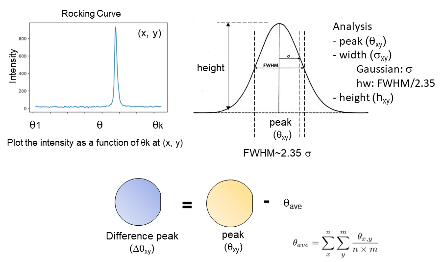

**Fig.3　Flow of RC analysis**

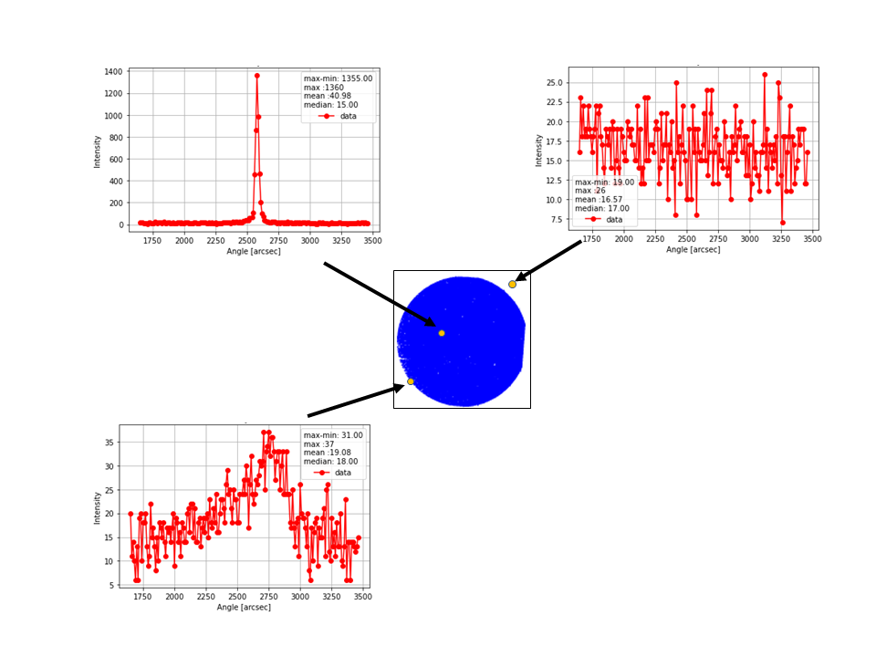

**Fig 4. An example of  RC curves at each  point** 

Figure 4 shows An example of  RC curves at each  point. Outside the area of the wafer is the noise level. In the edge region, a broad distribution can also be seen. In RC analysis, the filter parameter is set to exclude the outside of the wafer area from the analysis target. If the difference between the maximum value ($ y_ {max} $) and the minimum value ($ y_ {min} $) of the RC intensity is smaller than the filter value, it is regarded as noise and excluded from the analysis target. The value of Nan is input to the analysis value so as not to affect the calculation of the average value.

Conditions to be analyzed
$$
y_ {max} -y_ {min}> filter
$$
The gaussian fitting method also sets PMAX.
$$
y_ {max}> y_ {median} + PMAX
$$
In addition to the filter condition, if the maximum value of RC intensity ($ y_ {max} $) is smaller than the median value ($ y_ {median} $) + PMAX, it is excluded from the analysis target and Nan is input. Under this condition, an extremely broad distribution can be removed. In addition, Nan is input even when Fitting does not converge. (Extremely broad peaks often do not converge even if they are not removed under these conditions)

Cases where Nan is input

- hw method : (1)  $y_{max}-y_{min} < filter$ (Out of Wafer)

- gaussian method :(1) $y_{max}-y_{min} < filter$ (Out of Wafer), (2) $y_{max} <y_{median} + PMAX$, (3) Fitting does not converge.


- RC calculation

```python
# RC hw (full width half maxima)  fitting

# core: Use multi-process PC cores. Attention memory size.

# filter: Filter parameters are set to exclude noise level signals from the analysis. 
# It is only analyzed if the difference between the maximum and minimum RC intensities is greater than the filter value. 
# If it is not included in the analysis, enter the value of Nan as the analysis value.


cores = 4
t_file = g_0
t_folder,_ = fit_q.fit_analysis(target_file=t_file, filter=30, method='hw', comment='0data', core=cores)
print('')

c_file = g_120
c_folder,_ = fit_q.fit_analysis(target_file=c_file, filter=30, method='hw', comment='120data', core=cores)
print('')


# RC gauss fitting

# pmax: In addition to the filter condition, 
# if the condition with low distribution intensity (maximum intensity> median intensity + PMAX) is not satisfied,
# it is excluded from the analysis. If it is not analyzed, or if the fitting fails, the value of Nan is entered.

# method: gaussian 

# t_file = g_0
# t_folder = fit_q.fit_analysis(target_file=t_file, filter=30, pmax=30, method='gaussian', comment='0data', core=cores)
# print('')

# c_file = g_120
# c_folder = fit_q.fit_analysis(target_file=c_file, filter=30, pmax=30, method='gaussian', comment='120data', core=cores)
# print('')

```


```python
>>>0data
>>>target file:D:\XrayDataset_for_paper\data_0
>>>Elasped time: 93.1[s] @ 4 cores
>>>Comment: 0data
>>>Output file name: hw_220222_132908_c.npy
>>>Folder name: C:...\xrdt\hw_220222_132908
>>>----------

>>>120data
>>>target file:D:\XrayDataset_for_paper\data_120
>>>Elasped time: 74.9[s] @4 cores
>>>Comment: 120data
>>>Output file name: hw_220222_133037_c.npy
>>>Folder name: C:...\xrdt\hw_220222_133037
----------
```

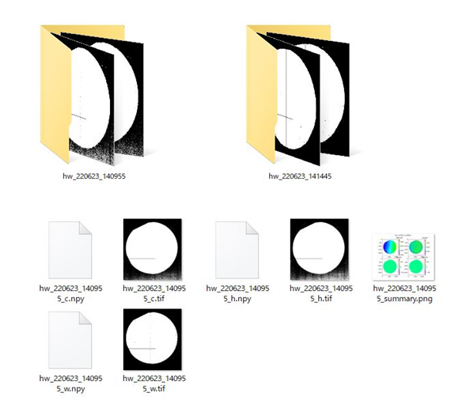

**Fig. 5 The output folders and files after performing RC analysis.**

Fig. 5 shows The output folders and files after performing RC analysis. The analyzed data is stored in a new folder (folder name: analysis name + _date+ _time,  example:  hw_220222_133037).

The output folder contain files with the following appended names to the folder name, _c.npy, _h.npy, _w.npy, _c.tif, _h.tif, _w.tif, _summary.png. 

The .npy file is the python numpy data saved in binary format by the tofile method. This file is missing shape (Rows and columns) information because it is serialized when it is saved. The .tif file is tif image file.

_c : peak data. The unit is arcsec.

_h: height data.

_w: sigma data. The unit is arcsec.　The _w file is sigma for Gauss method and FWHM / 2.35 for hw method.

- Check results

```python
rc0 = rean.load_rc_tif(t_folder)
mlplt.rc_12plots(rc0, title='$\psi$=0')

rc120 = rean.load_rc_tif(c_folder)
mlplt.rc_12plots(rc120, title='$\psi$=120')

"""
See docstring of this function.
function :rean.load_rc_tif(folder_name) :
return dict {'c':peak(arcsec), 'h':height, 'w':FWHM(arcsec), 'ct':peak - peak average(deg), 'ht':(height - height average)/height average, 'wt':FWHM(deg])}

Note: w is converted to FWHM instead of sigma. FWHM ~2.35xsigma

"""
```


---

#### (3) Image trimming

Specify the trimming position according to the GUI and execute.

- Trimming

```python
# psi=0
# 2 inch: wh(width,height)=1100, 4 inch: wh=2000, M :wh=500
#  Wait a few seconds and a new GUI window will appear.
wh4 = 2150
wh2 = 1100
whm = 500
wh_set = wh2
tr_t_folder = imt.gui2trim(t_folder, wh=wh_set, NX=2368, NY=2240, time_out=120)
```


```python
# psi=120
tr_c_folder=imt.gui2trim(c_folder, wh=wh_set, NX=2368, NY=2240, time_out=120)
```

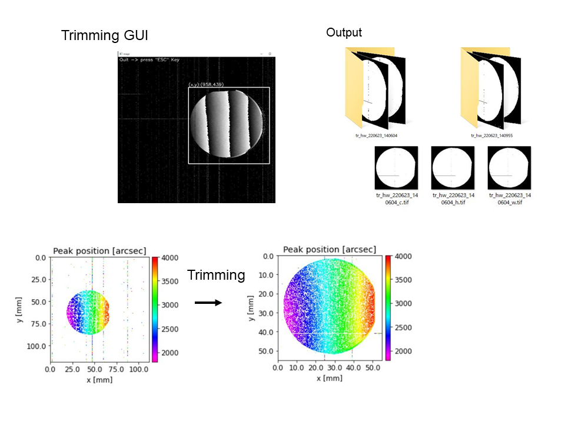

**Fig. 6 The trimming by GUI and the output data.** 

Fig. 6 shows the trimming by GUI and the output data. The trimmed data is stored in a new folder (folder name: "tr_"+"Load folder", e.g. tr_hw_220222_133037). The output folder contain files with the file names _c.tif, _h.tif, and _w.tif appended to the folder name.


---

#### (4) Image rotation

##### Checking the origin of the detector coordinates

The image data is the left-handed coordinate (the origin is on the upper left). The obtained image data may be flipped horizontally or vertically with respect to the actual wafer arrangement.

Fig.7 is a schematic diagram of the origin of the device and detector in our measurement system and the obtained image. The origin position of the detector is different from that of the actual measurement system, and the direction of the x-axis of the detector is inverted with respect to the measurement system.


**Fig.7　Schematic diagram of the origin of the device and detector in our measurement system and the resulting image**


Fig. 8 is a schematic diagram of the position of the sample placed on the sample table (upper side) and the image data (lower side) of the detector in our experimental setup with respect to the X-ray incident direction.


**Fig.8 Schematic diagram of the position of the sample placed on the sample table (upper side) with respect to the X-ray incident direction and the obtained image data (lower side) with the detector in our experimental setup.**

Under such conditions, it is necessary to perform flip on the x-axis for analysis. To perform a flip on the X-axis, you can flip it by changing **x-Scale** to **-** with the GUI image conversion software (Image Editor) in the package. In this experiment, the x-axis inversion is performed for each image in the Image Editor, and then the rotation translation operation is performed to align the images.


##### Superimpose the two orientation data 

Using a GUI program, load the tif image files for the two orientations and perform affine transformations (rotation (including flipping), translation, and scaling) of the images to superimpose the two images.

After starting the program, superimpose the two images using the following operation. For detailed instructions on how to use this program, please refer to *Image_editor_manual.md*.


(1) Specify the folder that contains the data and read the data.

- Upper left window: Select data folder (psi=0)

- Set the reading step (1: all files, default 16)

- Middle left window: Select data folder (e.g. psi=120)

- Set the reading step (1: All files, default 16)

(2) Adjust the parameters on the right side of window to rotate, move, and scale the image.

- If you need to flip the x-direction, set the scale original x to -1.
  (Set *x-Scale* to *-* for horizontal inversion and *y-Scale* to *-* for vertical inversion.)

- Change the parameters of  x,y, rotation, and scale.

(3) Export from the File menu.

(4) Quit from the File menu.

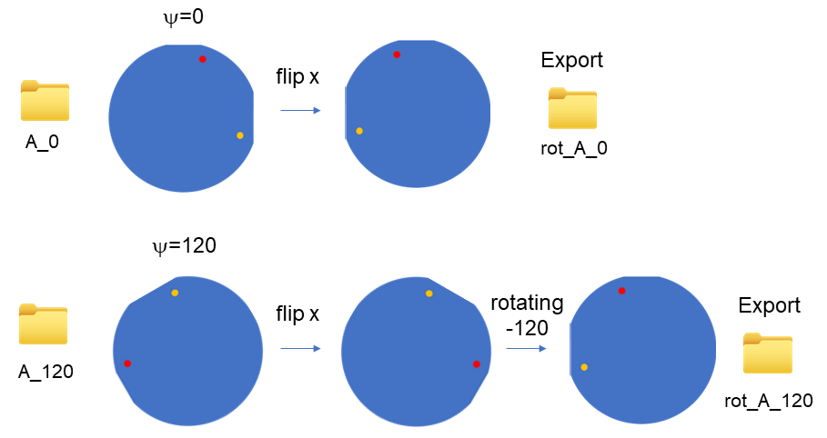

**Fig.9 Examples of Flip and rotation operations in our data.**

Fig. 9 is an example of a data flip and rotate operation. Read the data in each direction and perform a flip operation on the x-axis. The data at $\psi$ = 120 then rotates -120 ° (counter-clockwise) and moves in the x-axis and y-axis directions. Then, when the two images overlap, the export is carried out.


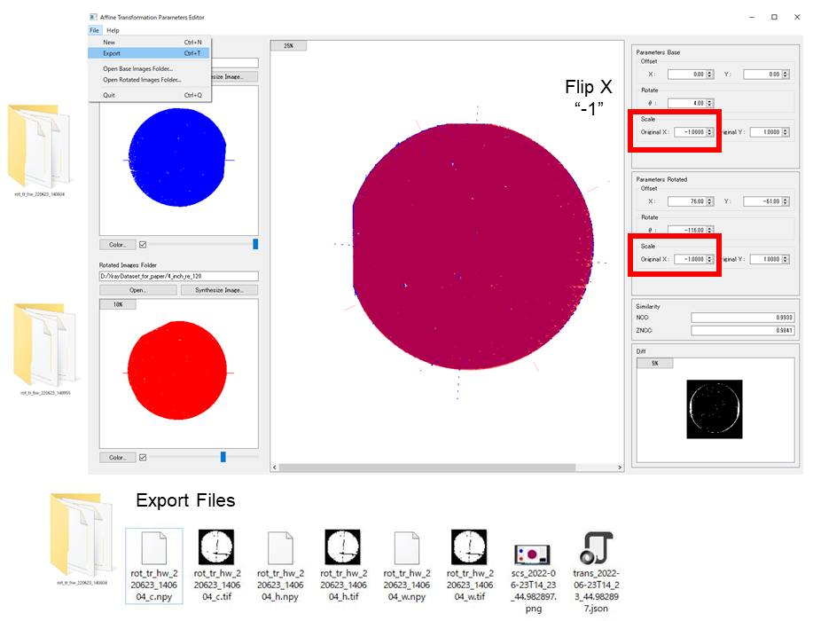

**Fig.10　Folders and data created after exporting after rotating the image**


The rotated data is stored in a new folder (folder name: rot_ + input holder name, e.g.rot_tr_hw_220222_133037 ). The output folder contain files with the file names_c.npy, _h.npy, _w.npy, _c.tif, _h.tif, _w.tif, scs・・・.png. and  trans ・・・.json.appended to the folder name.

_c : peak data. The unit is arcsec.

_h: height data.

_w: sigma data. The unit is arcsec.　The _w file is sigma for Gauss method and FWHM / 2.35 for hw method.

The scs ・ ・ ・ .png file is a screenshot of the export. The trans ・・・ .json file is a parameter file for rotation and translation operations.

- Run the image editor

```python
#  Wait a few seconds and a new GUI window will appear.
outfolderlist,_ = imt.img_editor_process()
print(outfolderlist)

# out put folder name :rot_ + 'load folder name' e.g.: rot_tr_hw_220208_132247
# if missing outfolderlist, input the folder name.
# outfolderlist = ['','']

```


####  (5) h caluclation (q calculation)

The calculation of **h** is performed using the data from the combined image positions for the two orientations.


**Fig. 11 Flow of h calculation**


- Set the data used for calculation and then convert tif to npy

```python
# Set the data folder after rotation.
\# fr0=r'C:\Users\USER\Desktop\XRTD\xrdt\tr_hw_211226_215327'
\# fr120=r'C:\Users\USER\Desktop\XRTD\xrdt\tr_hw_211226_215523'

fr0 = outfolderlist[0]
fr120 = outfolderlist[1]

# convert tif to npy

r0 = fft.conv_tif2npy(file_dir=fr0)
r120 = fft.conv_tif2npy(file_dir=fr120)

# fft.fd_tif2fd_npy(file_dir=fr0)
# fft.fd_tif2fd_npy(file_dir=fr120)

# r0=fft.folder_file_list(fr0,look_for='npy')
# r120=fft.folder_file_list(fr120,look_for='npy')

print('psi=0')
print(r0)

print('psi=120')
print(r120)
```

Since it is necessary to use the _c.npy file that has the angle information of peak (unit arcsec) in the calculation of h, the tif file is converted to the npy file.

 Inside the calculation function, the difference angle (the angle average value subtracted, the angle unit (rad)) is derived from the _c file and the calculation is performed.


- Set each angle using the data of $\psi=0$ and $\psi=120$.

```python
# The '_c.npy' file is used to calculate q.
# if trimg,  NX and NY must be set to new values.

target_t_ = r0[0]
target_c_ = r120[0]

# set output folder name
out_file_ = '2R_0120'
# phi=0
set_angle_t = 0 
# phi=120
set_angle_c = 120

# If it is trimmed, change NX, NY.
out_q_folder = fit_q.q_analysis_2R(target_t=target_t_, target_c=target_c_, 	out_file=out_file_, angle_t=set_angle_t, angle_c=set_angle_c, q=6.258 ,NX=wh_set, NY=wh_set)
```


- Check results

```python
# Check results
q_0120 = rean.load_q_tif(out_q_folder)
mlplt.qcp_12plots(q_0120,title='q (0,120)',step=50)
mlplt.qp3_4plots(q_0120, title='q polar',step=50)
mlplt.qp_3plots(q_0120, title='q polar analysis',step=50)

"""
See docstring of this function.
function :rean.load_q_tif(str:folder):
Returns:dict 
{'x':qx, 'y':qy, 'z':qz, 
'xy':sqrt(qx^2+qy^2), 
'ang':polar codinate angle between Z and r  -> q_ang: theta, 
'angxy':polar codinate angle between x and y -> q_angxy: phi,
'r':sqrt(qx^2+qy^2+qz^2)}
"""
```


---


#### (6) Examples of Calculation Results

##### C-Surface  4 inch ($\psi$ = 0, -120, 120)

- RC resutlt at  $\psi$＝0, hw method

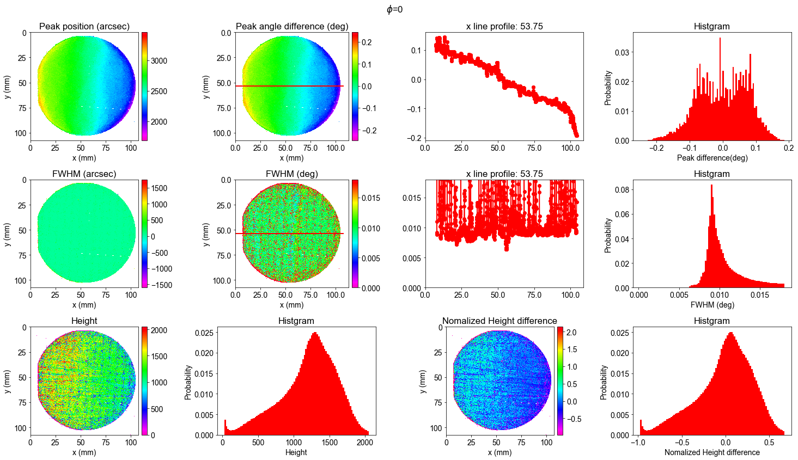


- h (3 orientaion average)


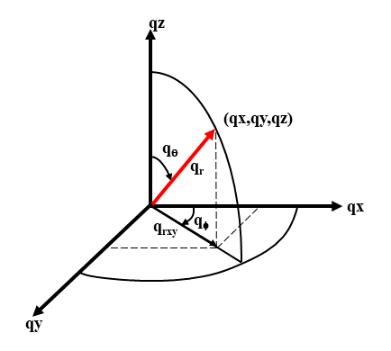

**Polar coordinate**

$qx,qy,qz$ convert to polar coordinate. $q_\theta$ indicates the inclination from the $qz$ direction (the amount of bending), and  $q_\phi$ indicates the angle between $ qx $ and $ qy $ (the direction of bending).

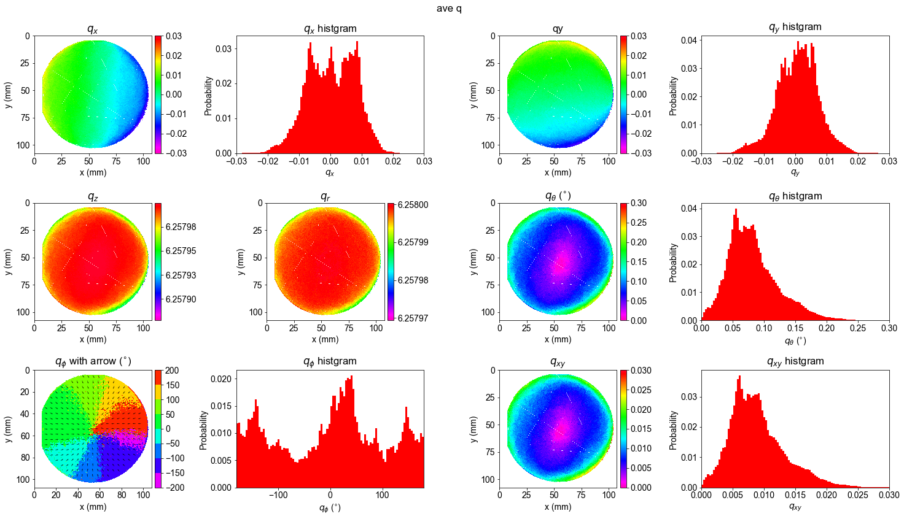


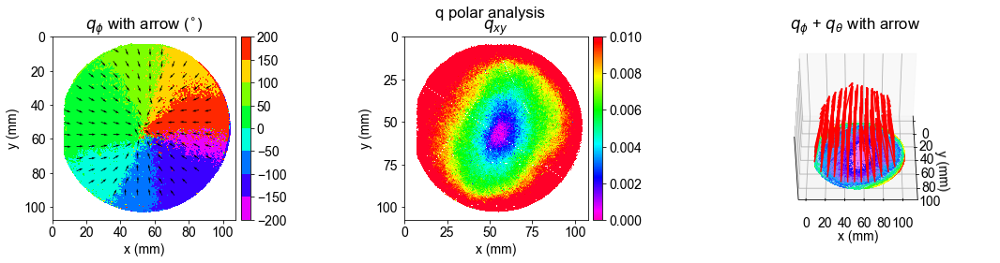


---

### 4. Our experiment setup and conditions


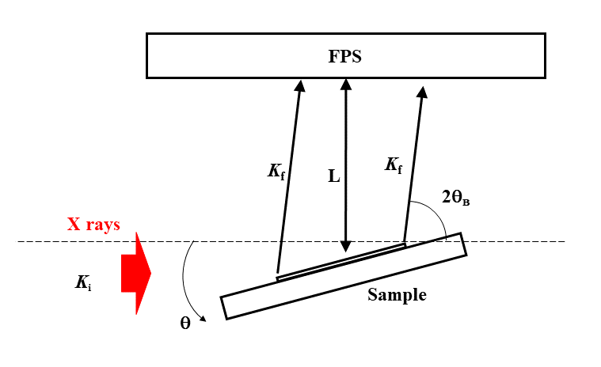

##### X rays

- Synchrotron X-ray Station at SPring-8

- wavelenght: 0.1- 0.25nm monochromatic and parallel

- Spread: $\Delta \lambda /\lambda_{ave} < 10^{-4}$, ($\lambda_{ave}$ : center wavelength of the X-ray)

- Spread angle:  within 30 arcsec

##### 2D-detector(FPS)

- size: 2368ｘ2240 pixcel, (50μm(0.05mm) x 50μm /pixcel), 118.4mmｘ112mm

##### Spatial resolution

- Spetial resolution is determined by the size of the pixels Δp of the 2D X-ray detector. 

- The range of the extinction distance of X-rays from the sample surface, which depends on the wavelength of the incident X-rays, the sample, and the diffraction index, is typically a few micrometers.

- $\Delta P$ (pixel size) :50 µm

- L (camera distance from substrate to detector) : 0.5 m,

- Bragg angle: $\theta_B$=39.67°

- GaN[11-24]  lattice planes :1.006 Å

- $\Delta d/d < 2.18 \times 10^{-4}$

- $\Delta\phi$: The deviation of the normal q of the crystal lattice plane from the normal averaged over the entire sample surface at each site on the sample.
$\Delta\phi< 50 \times 10^{-6} =1\times 10^{-4}(rad)(=0.006deg)$

---
### 5. Appendix

##### GaN orientation

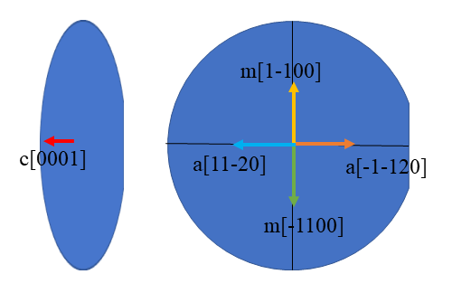

---
##### R matrix


$$
R(sin (\psi),cos (\psi),0, \Delta )\\
\\
R(0,1,0, \Delta \theta)\;at\;\psi=0\\
 \\
R(\frac{\sqrt{3}}{2} ,-\frac{1}{2} , 0, \Delta \chi)\;at\;\psi=120
\\
R(-\frac{\sqrt{3}}{2} ,-\frac{1}{2} , 0, \Delta \chi)\;at\;\psi=-120
\\
R(1,0,0, \Delta \chi)\;at\;\psi=90
$$


$$
\begin{pmatrix} q_{x}  \\ q_{y} \\q_{z} \end{pmatrix}=R\begin{pmatrix}\sin(\psi),cos(\psi), 0, \Delta\chi \end{pmatrix}R\begin{pmatrix}0, 1, 0, \Delta\theta \end{pmatrix}\begin{pmatrix} 0  \\ 0 \\q \end{pmatrix}
$$

$$
R(u_{x},u_{y},u_{z},\alpha)=\begin{pmatrix} cos\alpha+u^{2}_{x}(1-cos\alpha) & u_{x}u_{y}(1-cos\alpha)-u_{z}sin\alpha & u_{x}u_{z}(1-cos\alpha)+u_{y}sin\alpha\\ u_{y}u_{x}(1-cos\alpha)+u_{z}sin\alpha & cos\alpha+u^{2}_{y}(1-cos\alpha) & u_{y}u_{z}(1-cos\alpha)-u_{x}sin\alpha\\u_{z}u_{x}(1-cos\alpha)-u_{y}sin\alpha & u_{z}u_{y}(1-cos\alpha)+u_{x}sin \alpha & cos\alpha+u^{2}_{z}(1-cos\alpha)\end{pmatrix}
$$
---

##### How to run GUI image conversion software (image editing)

There are two ways to run the Image Editor without using a template.

- Open Power Shell or Shell and run the following Python program.

Note: The path to the `affine_transformation_parameters_editor_r.py` program must be changed to the path from current directry. (On Linux and MacOS, run `python` as `python3`)

```powershell
python affine_transformation_parameters_editor_r.py
```


- Run ``run_image_editor.ipynb`` and execute the program in it.

---


##### Description of fit.py and q2.py

The analysis template (Jupyter Notebook) uses the Subprocess module to call the analysis programs (fit.py, q2.py); you can also call the *fit.py* and *q2.py* programs directly from Shell to perform analysis.

##### RC analysis (Description of fit.py)

Two methods are implemented in the RC analysis: the Gauss fitting method and the full width half Maxmum (FWHM) method. Multiprocess is used for parallel computation of both methods.

The analysis is performed for each of the two orientations.

fit.py can be run from Powershell with the following arguments 

```python fit.py data method options``

where the arguments are specified as follows 

[Required]  

```
data : path to data directory, type=Path(str)
method : fitting method, choices=("gaussian", "hw")
	hw (half-width), gaussian (gaussian distribution)
```

  [Options]

```powershell
-f, --fmt : image data format, choices=("img", "tif"), default="img"

--xpos, -x : set x position, type=int
--ypos , -y : set y position, type=int
	used for testing the fitting algorithms at a single x,y location
	
--nx : number of x pixels (Width=NX), type=int, default=2240
--ny : number of y pixels (Height=NY), type=int, default=2368
	allows to set other image sizes than the default

--pmax : PMAX for only use gaussian fitting, type=int)
	If peak hight < peak hight average +pmax, then fitting values nan.
	
--background, -b : subtract background
	subtract the background before fitting. This has no effect with the currently implemented fitting methods.

--show, -s : show graph
	generate images from the output

--showonly : only show graph
    Assumes that fitting has been finished and only generates images.
    (all other options should be the same as during fitting)
    
--pool, -n : number of cpus to use, default=1, type=int
	Use mutiple processors. About 2-4 GB of memory for each process are needed.
	
--logpath , -l : reroute output to logfile, type=Path
--outpath, -o : npy data path basename
--findmax : max for each data file
	Calculate value distribution for each data file (debugging only)
	
--cut : replace values > threshold by nan, type=float
	replace values > threshold by nan (debugging only)
	
--debug , -d : output debug information

--verbose, -v : more verbose output

--filter : filter signals by minmax difference, default=0.0, type=float
	Do not fit signals if difference between min and max is less than chosen threshold
	If the difference of the intensity of (max-min) is less than options["filter"], then the fitting value is nan.
```

---

##### h calculation (Description of ｑ2.py)

The q-vector is calculated using the data from the RC analysis and alignment for the two azimuths.

```powershell
python q2.py -t XXX(THETA).npy -c YYY(CAI).npy 
```
[Required] 

```
-t, --dtheta : data file with delta theta data [arcsec] (XXX.npy：psi 0 deg peak data)
-c, --dchi : data file with delta chi data [arcsec] (YYY.npy：psi 120 or 90 deg peak data)
```

[Opthions]

```powershell
-h, --help : show this help message and exit
--nx : number of x pixels (Width), default=2368, type=int, (image.shape->ny(h) x nx(w))
--ny : number of y pixels (Height), default=2240, type=int, (image.shape->ny(h) x nx(w))
--anglet : t angle[deg]: 0, 120, -120, 90, -90 or int, type=int
--anglec : c angle[deg]: 120, -120, 90, -90 or int, type=int

-q : set q unit:Angstrom^-1, default=1.0, type=float
-p, --prefix : prefix for output images, default="vdata", type=str
-l, --logpath : reroute output to logfile
-d, --debug : output debug information
-v, --verbose : more verbose output
-s, --show : show graph
```


---

### Reference

#### V-LBLP analysis 

[1] Sakata, O. , Yagyu, S. sbmitted.

##### 2 inch

[2] Kim, J., Seo, O., Song, C., Hiroi, S., Chen, Y., Irokawa, Y., Nabatame, T., Koide, Y. and Sakata, O. (2018). Lattice-plane Orientation Mapping of Homoepitaxial GaN(0001) Thin Films via Grazing-incidence X-ray Diffraction Topography in 2-in. Wafer. Applied Physics Express, 11(8), 081002. 6-16 AIP Publishing Books

##### 4 inch

[3] Kim, J., Seo, O., Song, C., Chen, Y., Hiroi, S., Irokawa, Y., Nabatame, T., Koide, Y. and Sakata, O. (2018). Characterization of a 4-inch GaN Wafer by X-ray Diffraction Topography. CrystEngComm, 20(48), pp. 7761-7765. 

##### 6 inch

[4] Jaemyung Kim, Okkyun Seo, L. S. R. Kumara, Toshihide Nabatame, Yasuo Koide, Osami Sakata. Highly-crystalline 6 inch free-standing GaN observed using X-ray diffraction topography. CrystEngComm. 23 [7] (2021) 1628-1633 10.1039/d0ce01572e 

##### M-plane

[5] Kim, J., Seo, O., Tanaka, A., Chen, J., Watanabe, K., Katsuya, Y., Nabatame, T., Irokawa, Y., Koide, Y. and Sakata, O. (2019). Anisotropic Mosaicity and Lattice-plane Twisting of an m-plane GaN Homoepitaxial Layer. CrystEng Comm, 21(27), pp. 4036-4041. 

##### Review

[6] ”Characterization of Defects and Deep Levels for GaN Power Devices”Editors Tetsuo Narita and Tetsu Kachi, Chapter 6 Local Lattice Plane Orientation Mapping of Entire GaN Wafer
Authors Osami Sakata and Jaemyung Kim
https://doi.org/10.1063/9780735422698_006
Pages: 6-1–6-12

##### Patent

[7] [[JP2019190965A](https://patents.google.com/patent/JP2019190965A/ja)](https://patents.google.com/patent/JP2019190965A) JP2019-190965A


#### Others  (GaN sample)

[8] Seo, O, Kim, J., Song, C., Lou, Y., Kumara, L. S. R., Hiroi, S., Chen, Y., Katsuya, Y., Irokawa, Y., Nabatame, T., Koide, Y. and Sakata, O. (2018). Evaluation of Lattice Curvature and Crystalline Homogeneity for 2-inch GaN Homo-epitaxial Layer. AIP Advances, 8(7), 075318. 

[9] Kim, J., Seo, O., Hiroi, S., Irokawa, Y., Nabatame, T., Koide, Y. and Sakata, O. (2020). Surface Morphology Smoothing of a 2 inch-diameter GaN Homoepitaxial Layer Observed by X-ray Diffraction Topography. RSC Advances, 10(4), pp. 1878-1882.

[10] Kim, J., Seo, O., Song, C., Hiroi, S., Chen, Y., Y., Irokawa, Y., Nabatame, T., Koide, Y. and Sakata, O. (2019). Lattice-plane Bending Angle Modulation of Mg-doped GaN Homoepitaxial Layer Observed by X-ray Diffraction Topography. CrystEngComm, 21(14), pp. 2281-2285. 

[11] Lou, Y., Song, C., Chen, Y., Kumara, L. S. R., Palina, N., Seo, O., Hiroi, S., Kajiwara, K., Hoshino, M., Uesugi, K., Irokawa, Y., Nabatame, T., Koide, Y. and Sakata, O. (2018). Synchrotron X-ray Diffraction Characterization of the Inheritance of GaN Homoepitaxial Thin Films Grown on Selective Growth Substrates. CrystEngComm, 20(20), pp. 2861-2867. 

[12] Kim, J., Seo, O., Song, C., Hiroi, S., Chen, Y., Irokawa, Y., Nabatame, T., Koide, Y. and Sakata, O. (2019). Mapping of a Lattice-plane Tilting in a GaN Wafer using Energy-resolved X-Ray Diffraction Topography. Physical Review Applied, 11(2), 024072

