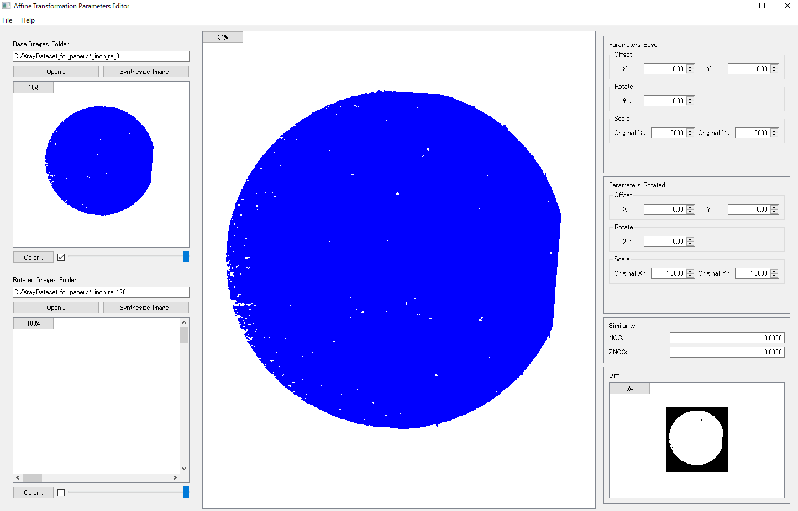
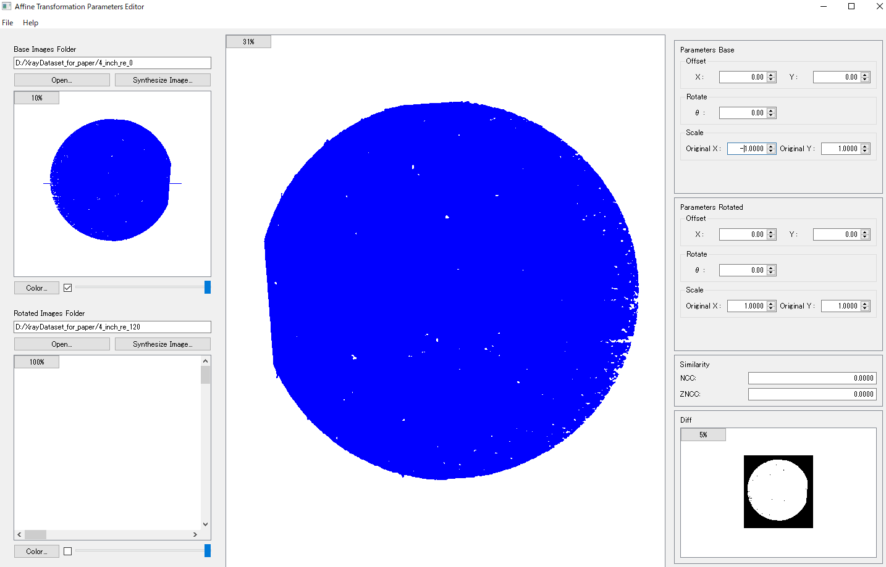
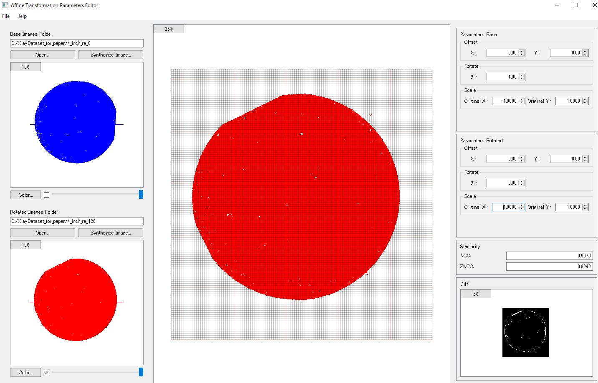
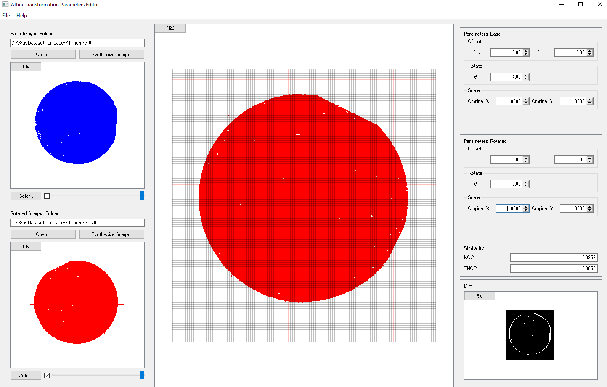
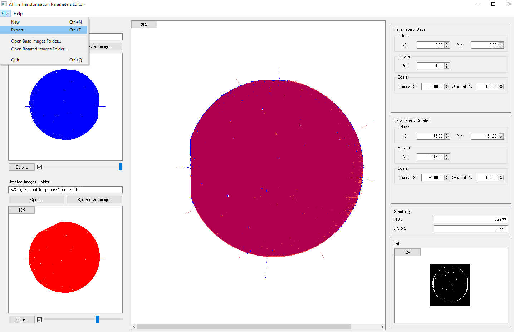

# Image Editor manual

How to use the image editor


### About the Image Transformation Program

This GUI image transformation program performs affine transformations (image rotation (including flipping), translation, and scaling) while comparing images in two orientations.


### How to Use

#### 0. Checking data and folders

- The tif data for each angle is stored in the data folder for each orientation.

- Confirmation of sample placement in the experiment. (The measured image data is inverted with respect to the actual sample placement due to the origin position of the detector, etc. In the data used in this analysis, the actual sample placement is are reversed.)


#### 1. how to start

There are two ways to start this program.

##### Startup method 1

Start from the attached Jupyter file (**run_image_editor.ipynb**)
```python
from qfit import image_treat as imt

_ = imt.img_editor_process()
```
`xrdt/image_editor/affine_transformation_parameters_editor_r.py` I am running this program using subprocess.

It takes about 10-60s for the program Window to start up.

The template for analysis is also started using subprocess.


##### Startup method 2

Move to the folder where this GUI image conversion program exists, and enter and execute the following command from Powershell or Command Prompt.

```shell
./xrdt/image_editor/affine_transformation_parameters_editor_r.py
```

- Windows

```shell
python  affine_transformation_parameters_editor_r.py 
```
- Linux or Mac
```shell
python3  affine_transformation_parameters_editor_r.py 
```


#### 2. Data loading and adjustment


As an example, GaN 4-inch data will be used for explanation. GaN_n1_4_0 ($\psi$=0) and GaN_n1_4_120 ($\psi$=120) contain measurement image data (.tif).

When the GUI application starts up, read the data of $\psi$=0.

Select the folder containing the data from the *open* button on the left. The image is displayed as a combination of multiple images. At this time, the number of thinnings from all images is selected. If the thinning number is small, the processing will be heavy, but if it is too large, the contours of the images will blur and superimposition will become difficult. If you want to set the thinning number again, you can set it again by pressing the *Synthesize Image* button.

You can select your favorite color with the *color* button, turn the image display on/off with the check box on the right, and change the transparency with the slider.

How to use mouse and wheel
- Change image size with wheel
- left click to switch grid
- Right click to fit image height to screen.
- See *Menu -> Help* for details.




The read data is inverted with respect to the x-axis because the x-axis of the detector is inverted with respect to the actual placement.

For this, set *Parameters Base -> Scale -> Original X:* to *-1*. This causes image inversion with respect to the X-axis. The image on the left side of the window is the image of the original data read.




Similarly, read the data of $\psi$=120.



*Parameters Rotaion -> Scale -> Original X:* set*-1*.This inverts the image with respect to the X axis.



After inverting, rotate the image 120 degrees counterclockwise (clockwise is the standard, so input -120). At that time, the image of $psi$ = 0 and the center position are misaligned, so adjust offset X, offset Y, rotation, and scale so that they overlap as much as possible.




Similarity is displayed in the lower right as an index of the degree of overlap.

Normalized Cross Correlation (NCC) Zero-mean Normalized Cross Correlation (ZNCC) *Both values range from -1.0 to 1.0, with values closer to 1.0 indicating similarity.

After adjusting, convert and save the adjusted data with *File -> Export*.

A new folder is created in the same directory as the read data, and the converted tif data is saved. Also, the screenshot and the conversion parameter file when *Exporting* are saved in the same folder.

The name of the new folder will be *rot_* + the loaded folder name.

Note that when you export, both of the two data you are reading are converted. Also, only the tif image data in the original folder being loaded is converted and saved. (Text format angular files are not copied, so you need to manually copy them to the converted folder.)

After exporting the image, exit the program with *File menu -> Quit*.

In addition, in the case of three directions,

Press the *Rotation Image Folder -> Open* button for the $\psi$ = -120 data, select the folder containing the data, and then perform the same operation as for $\psi$ = 120.


